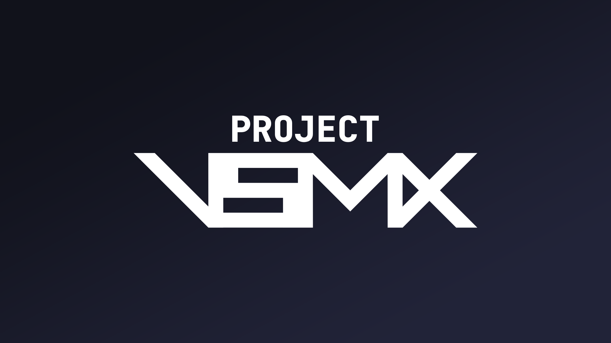
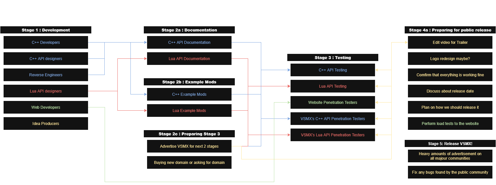

---

<h1 align="center">The BIGGEST Scrap Mechanic SDK Mod You've Ever Seen</h1> 

**VSMX** is a DLL-based SDK mod for [**Scrap Mechanic**](https://store.steampowered.com/app/387990/Scrap_Mechanic/) that heavily modifies the game to give modders far more creative freedom than the current Lua API allows.

VSMX is what we (modders) have always wanted in the game, something that enables more innovation and opens up new possibilities for modding.

> [!IMPORTANT]
> VSMX is currently in **DEVELOPMENT** and is **NOT** ready for production. We're still finalizing the main DLL before starting work on the VSMX extensions, where the BIG features will be.

> [!NOTE]
> If you want to be part of the VSMX project and help us out, contact @vera_dev on Discord!

<h1 align="center">VSMX's Roadmap / Development Stages</h1>

